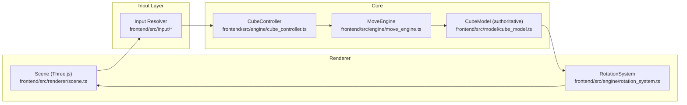

**Frontend (Three.js) Overview**

- **Purpose:** concise Three.js-based frontend that renders the authoritative `CubeModel`, accepts camera-relative input, and animates moves computed by the `MoveEngine`.

**Architecture**
- **Renderer:** Three.js scene draws the cube and UI. Main entry: [frontend/src/renderer/scene.ts](frontend/src/renderer/scene.ts).
- **Input Capture:** Mouse and keyboard events are captured in the scene and passed to the input layer ([frontend/src/input/input_controller.ts](frontend/src/input/input_controller.ts)) and camera-facing resolver ([frontend/src/input/camera_face_resolver.ts](frontend/src/input/camera_face_resolver.ts)).
- **Controller (authoritative):** `CubeController` queues intents, calls `MoveEngine`, and commits changes to the authoritative model before animation: [frontend/src/engine/cube_controller.ts](frontend/src/engine/cube_controller.ts).
- **Move Logic:** `MoveEngine` computes atomic move results (new cubie positions and affected sets): [frontend/src/engine/move_engine.ts](frontend/src/engine/move_engine.ts).
- **Model:** `CubeModel` is the single source of truth for cubie state and IDs: [frontend/src/model/cube_model.ts](frontend/src/model/cube_model.ts).
- **Animation/Sync:** `RotationSystem` animates Three.js meshes to match committed model snapshots; scene resynchronizes meshes after commit: [frontend/src/engine/rotation_system.ts](frontend/src/engine/rotation_system.ts) and [frontend/src/renderer/scene.ts](frontend/src/renderer/scene.ts).

**Runtime Debug & Verification**
- **Debug toggle:** Controlled by the `DEBUG` flag; enable with the query param `?debug=1` (see [frontend/src/config.ts](frontend/src/config.ts)).
- **Verifier:** Dev-only runtime verifier compares `CubeModel` snapshots with scene meshes and throws/logs if mismatches are found: [frontend/src/debug/verify.ts](frontend/src/debug/verify.ts).

**High-level Flow**
- **Event → Resolve → Engine → Commit → Animate → Resync**
  - Scene captures input → input resolver determines face/axis → `CubeController` invokes `MoveEngine` → commit changes to `CubeModel` → `RotationSystem` animates affected meshes → scene updates mesh positions from the model and runs verifier when `DEBUG` is enabled.

**Key Files**
- **Entry:** [frontend/src/main.ts](frontend/src/main.ts)
- **Renderer / Scene:** [frontend/src/renderer/scene.ts](frontend/src/renderer/scene.ts)
- **Cube Shell / Meshes:** [frontend/src/renderer/cube_shell.ts](frontend/src/renderer/cube_shell.ts)
- **Input:** [frontend/src/input/input_controller.ts](frontend/src/input/input_controller.ts), [frontend/src/input/camera_face_resolver.ts](frontend/src/input/camera_face_resolver.ts), [frontend/src/input/face_mappings.ts](frontend/src/input/face_mappings.ts)
- **Engine:** [frontend/src/engine/move_engine.ts](frontend/src/engine/move_engine.ts), [frontend/src/engine/cube_controller.ts](frontend/src/engine/cube_controller.ts), [frontend/src/engine/rotation_system.ts](frontend/src/engine/rotation_system.ts)
- **Model:** [frontend/src/model/cube_model.ts](frontend/src/model/cube_model.ts)
- **Debug:** [frontend/src/debug/verify.ts](frontend/src/debug/verify.ts), [frontend/src/config.ts](frontend/src/config.ts)

**Run & Test**
- Install deps and run the dev server from the `frontend` folder:

```bash
cd frontend
npm install
npm run dev
```

- Run tests (Vitest):

```bash
cd frontend
npm install    # if not already installed
npm test
# or run once without installing via npx
npx vitest
```

**Notes & Tips**
- The `CubeModel` is authoritative; animations are visual-only and meshes are resynchronized from the model after each commit.
- Camera-relative input mapping aims to match the Ursina/Python behavior (W/A/S/D/E keyboard mapping and camera-facing click semantics). See `face_mappings.ts` and the camera face resolver for the rules.
- Use `?debug=1` in the app URL to enable `console.debug` output and runtime verification.

**Next Steps (optional)**
- Ensure highlight code exactly matches `MoveEngine`'s `affected` set (review and fix highlight mapping).
- Add more deterministic integration tests that compare `MoveEngine` outputs against Python reference data.

If you want, I can add a small flow diagram or expand the README with developer setup notes (VS Code tasks, lint/test hooks).

**Ursina → Frontend Mapping & Flow**

This project re-implements the Ursina responsibilities using a custom Three.js layer and a small input/controller stack. The diagram below shows how events flow and which files correspond to Ursina concepts.



Mapping notes:
- Ursina `on_mouse_down` / `on_key` handlers → `frontend/src/renderer/scene.ts` (captures events) + `frontend/src/input/input_controller.ts` (maps keys to intents).
- Ursina's cube entity + model → `frontend/src/renderer/cube_shell.ts` (meshes) + `frontend/src/model/cube_model.ts` (state).
- Ursina move execution → `frontend/src/engine/move_engine.ts` (computes new positions) + `frontend/src/engine/cube_controller.ts` (commits model) + `frontend/src/engine/rotation_system.ts` (animates meshes).
- Debug / verification: `frontend/src/debug/verify.ts` and `frontend/src/config.ts` (?debug=1).

This should help map Ursina concepts to the files you’ll work with when extending or debugging the frontend.